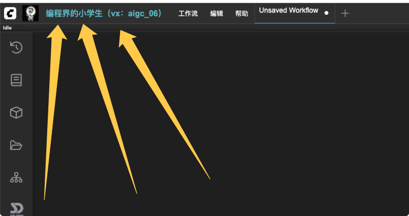

# ComfyUI 可配置菜单扩展

[](https://github.com/programming-pupil/ComfyUI-CustomMenu)
[](LICENSE)
[](https://github.com/comfyanonymous/ComfyUI)

一个完全可配置的 ComfyUI 前端菜单扩展，让你轻松自定义菜单结构、样式和功能，无需修改任何代码！

## 手册
[https://plugin.aix.ink/archives/CGSFIC6p](https://plugin.aix.ink/archives/CGSFIC6p)

## 效果


## ✨ 核心特性

- 🎯 **完全可配置** - 通过 JSON 配置文件控制所有菜单项、样式、图标
- 🔧 **零硬编码** - 不再有写死的路径或目录名，一切皆可配置
- 🎨 **自定义样式** - 支持为每个菜单项设置独立的颜色、尺寸、字体等样式
- 📱 **多种动作类型** - 支持打开链接、显示二维码、弹窗提示、控制台日志等
- 🔄 **自动路径检测** - 智能检测扩展安装路径，无需手动配置
- 📦 **一键安装** - 提供自动安装脚本，支持 Windows/Linux/macOS
- 🔀 **菜单排序** - 可控制菜单在顶部菜单栏中的位置（前置/后置）
- 🖼️ **图标支持** - 为每个菜单项添加自定义图标
- 📱 **二维码展示** - 内置二维码弹窗功能，支持标题和描述

## 🚀 快速开始

### 自动安装（推荐）

#### Windows 用户
```bash
# 双击运行
install.bat
```

#### Linux/macOS 用户
```bash
chmod +x install.sh
./install.sh
```

### 手动安装

1. 将整个项目文件夹复制到 ComfyUI 的 `comfyui_frontend_package/static/extensions/` 目录下
2. 重命名文件夹为 `ComfyUI-CustomMenu`
3. 刷新 ComfyUI 页面

## 📋 配置说明

### 基础配置结构

```json
{
    "extensionName": "MyCustomMenu",
    "commands": [...],
    "menuStructure": [...],
    "iconMapping": {...},
    "menuOrder": {...},
    "menuStyling": {...}
}
```

### 1. 命令配置 (commands)

定义所有可用的菜单命令：

```json
{
    "commands": [
        {
            "id": "uniqueCommandId",
            "label": "显示在菜单中的文本",
            "action": {
                "type": "动作类型",
                "value": "动作参数"
            }
        }
    ]
}
```

#### 支持的动作类型

##### 🔗 打开链接 (`open_url`)
```json
{
    "type": "open_url",
    "value": "https://example.com"
}
```

##### 📱 显示二维码 (`show_qrcode`)
```json
{
    "type": "show_qrcode",
    "value": {
        "image": "qr_code.png",
        "title": "扫码标题",
        "description": "扫码描述文字"
    }
}
```

##### 💬 弹窗提示 (`alert`)
```json
{
    "type": "alert",
    "value": "要显示的提示内容"
}
```

##### 📝 控制台日志 (`console_log`)
```json
{
    "type": "console_log",
    "value": "要输出到控制台的内容"
}
```

### 2. 菜单结构配置 (menuStructure)

定义菜单的层级结构：

```json
{
    "menuStructure": [
        {
            "path": ["一级菜单"],
            "commands": ["command1", "command2"]
        },
        {
            "path": ["一级菜单", "二级菜单"],
            "commands": ["command3"]
        },
        {
            "path": ["一级菜单", "二级菜单", "三级菜单"],
            "commands": ["command4"]
        }
    ]
}
```

### 3. 图标配置 (iconMapping)

为菜单项添加图标：

```json
{
    "iconMapping": {
        "菜单名称": "icon_file.png",
        "另一个菜单": "another_icon.png"
    }
}
```

> 📁 图标文件需放置在扩展目录的 `icons/` 文件夹中

### 4. 菜单排序 (menuOrder)

控制菜单在顶部菜单栏中的位置：

```json
{
    "menuOrder": {
        "topLevelMenuLabel": "要移动的顶级菜单名称",
        "position": "prepend"
    }
}
```

- `position`: `"prepend"` (移到最前面) 或 `"append"` (移到最后面)

### 5. 样式配置 (menuStyling)

为菜单项自定义样式：

```json
{
    "menuStyling": {
        "菜单名称": {
            "color": "#4CAF50",           // 文字颜色
            "width": "150px",             // 菜单宽度
            "height": "40px",             // 菜单高度
            "fontSize": "14px",           // 字体大小
            "fontWeight": "bold",         // 字体粗细
            "iconWidth": "24px",          // 图标宽度
            "iconHeight": "24px",         // 图标高度
            "padding": "6px 10px"         // 内边距
        }
    }
}
```

## 📁 项目结构

```
ComfyUI-CustomMenu/
├── ui.js                   # 主扩展文件
├── config.json             # 主配置文件
├── config.example.json     # 配置示例文件
├── install.sh              # Linux/macOS 安装脚本
├── install.bat             # Windows 安装脚本
├── INSTALL.md              # 安装说明
├── README.md               # 项目说明
└── icons/                  # 图标文件夹
    ├── 1.png              # 示例图标
    └── qr_code.png        # 示例二维码
```

## 🎯 使用示例

### 完整配置示例

```json
{
    "extensionName": "MyAwesomeMenu",
    "commands": [
        {
            "id": "homepage",
            "label": "官方网站",
            "action": {
                "type": "open_url",
                "value": "https://example.com"
            }
        },
        {
            "id": "docs",
            "label": "使用文档",
            "action": {
                "type": "open_url",
                "value": "https://docs.example.com"
            }
        },
        {
            "id": "contact",
            "label": "联系我们",
            "action": {
                "type": "show_qrcode",
                "value": {
                    "image": "contact_qr.png",
                    "title": "扫码联系我们",
                    "description": "微信: your_wechat_id"
                }
            }
        },
        {
            "id": "about",
            "label": "关于",
            "action": {
                "type": "alert",
                "value": "这是一个可配置的ComfyUI菜单扩展 v1.0"
            }
        }
    ],
    "menuStructure": [
        {
            "path": ["我的工具箱"],
            "commands": ["homepage", "docs"]
        },
        {
            "path": ["我的工具箱", "帮助支持"],
            "commands": ["contact", "about"]
        }
    ],
    "iconMapping": {
        "我的工具箱": "toolbox.png",
        "帮助支持": "support.png",
        "官方网站": "home.png",
        "使用文档": "docs.png",
        "联系我们": "contact.png",
        "关于": "info.png"
    },
    "menuOrder": {
        "topLevelMenuLabel": "我的工具箱",
        "position": "prepend"
    },
    "menuStyling": {
        "我的工具箱": {
            "color": "#2196F3",
            "width": "120px",
            "height": "36px",
            "fontSize": "14px",
            "fontWeight": "bold",
            "iconWidth": "20px",
            "iconHeight": "20px",
            "padding": "8px 12px"
        }
    }
}
```

## 🔧 高级功能

### 自动路径检测

扩展会自动检测安装路径，无需手动配置。

### 动态菜单更新

扩展支持动态监听页面变化，自动应用菜单配置：

- 页面加载时立即应用
- 延迟应用（500ms, 1500ms）确保兼容性
- 定期检查（每5秒）保持菜单状态
- DOM 变化监听，实时响应页面更新

### 错误处理

- 配置文件加载失败时使用默认配置
- 图标文件缺失时优雅降级
- 详细的控制台错误日志

## 🛠️ 故障排除

### 常见问题

#### 1. 菜单不显示
- ✅ 检查 `config.json` 文件语法是否正确
- ✅ 确认文件路径是否正确
- ✅ 查看浏览器控制台是否有错误信息

#### 2. 图标不显示
- ✅ 确认图标文件存在于 `icons/` 目录中
- ✅ 检查文件名是否与配置中的完全一致
- ✅ 确认图标文件格式（推荐 PNG）

#### 3. 二维码不显示
- ✅ 检查二维码图片文件是否存在
- ✅ 确认图片路径配置正确
- ✅ 检查图片文件是否损坏

#### 4. 样式不生效
- ✅ 确认菜单名称与配置中的完全匹配
- ✅ 检查 CSS 属性值格式是否正确
- ✅ 刷新页面重新加载样式

### 调试技巧

1. **查看控制台日志**：按 F12 打开开发者工具，查看 Console 标签页
2. **验证配置文件**：使用在线 JSON 验证器检查配置文件语法
3. **测试单个功能**：逐个测试每个菜单项功能
4. **重置配置**：使用 `config.example.json` 作为基础重新配置

## 📝 更新日志

### v1.0.0 (2025-07-10)
- ✨ 初始版本发布
- 🎯 支持完全可配置的菜单系统
- 🎨 支持自定义样式和图标
- 📱 支持多种动作类型
- 🔄 支持自动路径检测
- 📦 提供一键安装脚本

## 🤝 贡献指南

欢迎提交 Issue 和 Pull Request！

1. Fork 本项目
2. 创建特性分支 (`git checkout -b feature/AmazingFeature`)
3. 提交更改 (`git commit -m 'Add some AmazingFeature'`)
4. 推送到分支 (`git push origin feature/AmazingFeature`)
5. 打开 Pull Request

## 📄 许可证

本项目采用 MIT 许可证 - 查看 [LICENSE](LICENSE) 文件了解详情

## 🙏 致谢

- [ComfyUI](https://github.com/comfyanonymous/ComfyUI) - 强大的 AI 图像生成工具
- 所有贡献者和用户的支持

---

如果这个项目对你有帮助，请给个 ⭐ Star 支持一下！
